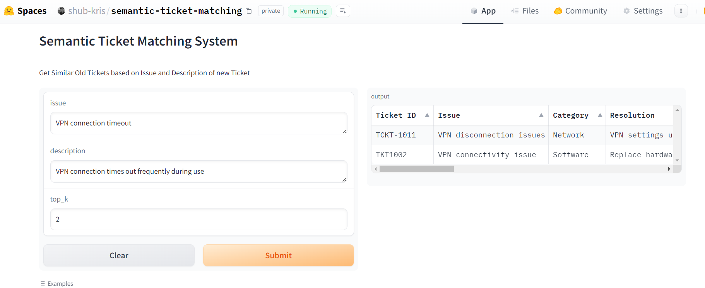

# Case Study for AI Solutions Engineer

## Problem

- **Goal**: Assist agents in finding a solution for incoming new tickets by utilizing information from previously resolved tickets.

- **Dataset**: 
    - `old_tickets`: Multiple files which contain information about tickets that have been resolved before. The information includes fields such as:
        - `Ticket ID`: Unique identifier for the ticket
        - `Issue`: Title of the ticket
        - `Category`: Category of the ticket, e.g. Software, Hardware, Network, etc.
        - `Resolution`: Solution provided for the ticket
        - `Resolved`: Whether the ticket is resolved or not
        - `Description`: Description of the ticket

    - `new_tickets.csv`: Tickets that you can use to test and evaluate your solution.

## Solution

I propose a Semantic Ticket Matching system that leverages: `Issue` and `Description` of the new ticket and the old tickets to find the most similar tickets. The system leverages a pre-trained LLM (`luminous-base`) from Aleph Alpha to encode the text data into a vector space and then uses a similarity metric to find the closest matches. The top matches can then be presented to the agent to assist them in finding a solution for the new ticket. A high level diagram of the solution can be seen below:

The developed solution is an intelligent search as it is much more than a simple text search. By analyzing the semantic meaning of ticket's `Issue` and `Description`, the system retrieves relevant historical tickets and provides valuable insights to aid in problem resolution.

The solution can be broken down into the following components:

1. **Embedding Old Tickets Data**:
    - Load the `old_tickets` data.
    - Preprocess the data by selecting only `Issue` and `Description` information.
    - Encode the extracted information using the pre-trained LLM model to obtain embeddings.
    - Save the embeddings along with the old ticket data.

2. **Search**:
    - Encode the new ticket `Issue` and `Description` data using the same LLM model.
    - Calculate the similarity between the new ticket and the historical tickets using a similarity metric (e.g., cosine similarity).
    - Retrieve the top `k` most similar historical tickets.

You can find the code for the same in the `solution.ipynb` notebook. The notebook contains detailed explanations of the code and the steps involved in the solution.

**Note**: The system returns both the `resolved` and `unresolved` tickets but it can be modified quite easily to return only the `resolved` tickets by filtering the `old_tickets` data based on the `Resolved` column.

### Hugging Face Spaces demo

I have also deployed the solution on the Hugging Face Spaces platform. You can access the demo using the following link: [Semantic Ticket Matching](https://huggingface.co/spaces/shub-kris/semantic-ticket-matching).  All you need to provide is the following information:

- `issue`: Issue of the ticket
- `description`: Description of the ticket
- `top_k`: Number of top matches to retrieve

The system will then return the top `k` most similar tickets based on the provided information.

A screenshot of how the spaces looks is attached below:

**Note**: As of now, the space is private and can't be accessed directly. Please let me know if you would like to access the space, and I can then make the space public or I can also demonstrate it during our discussion.

## Improvements

The system can be further improved by incorporating additional features such as a reranker, hybrid search, and explicit feedback from the agents using the system.

- **Smaller Language Model**: For calculating the embeddings I utilized the `luminous-base` LLM which contains `13B` parameters. It will perform really good but I expect smaller models like `distilbert-base-uncased` which contains `66M` parameters to also do a nice job. The advantage is the retrieval and embeddings can be faster compared to abigger LLM that contains billions parameters. So, I would have played with smaller models to see how they perform.

-  **Vector databases**: For storing the embeddings of the `old_tickets` data I utilised the `pandas DataFrame` but it won't scale as it is stored in memory. The system can be scaled by utilizing vector databases such as `Qdrant`, `Weaviate`, or others that can handle large-scale embeddings and provide efficient retrieval mechanisms.

- **Evaluation**: Qualitative Evaluation of the develop solution is a good first start. But, I would have also looked into doing a quantitative evaluation by calculating Information Retrieval metrics such as Mean Reciprocal Rank(MRR), Normalized Discounted Cumulative Gain (NDCG) and others to measure the performance of the system. I would have leveraged a LLM to build such a evaluation dataset. 

- **Reranker**: The system can be further improved by incorporating a reranker that reorders the retrieved tickets.

- **Hybrid Search**: The solution can also be improved by leveraging additional search such as text search based on BM25 or ElasticSearch to provide a hybrid search mechanism. This can help in providing a more diverse set of results. A lot of vector databases also provide this kind of support out of the box. 

- **Feedback Mechanism**: Incorporating an explicit feedback mechanism where agents can provide feedback on the relevance of the retrieved tickets can help in improving the system over time.